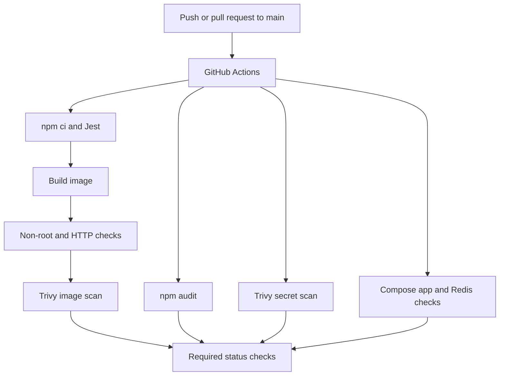

# Macky Merch API - secure delivery pipeline

Based on [the LSCS starter](https://github.com/dlsu-lscs/devsecops-exam-starter) at commit `8e66095e2406e7ff6c85103a6e9c424a7482f74b`. The starter's server and test are preserved. This workspace is an existing repository; importing starter files does **not** create a GitHub fork.

## Local setup

Install Node.js 24 LTS, then run:

```sh
npm ci --ignore-scripts
npm test -- --runInBand
npm start
```

Open http://localhost:3000/health. Expected response:

```json
{"status":"OK","message":"Macky Merch API is running smoothly."}
```

## Docker

Install Docker with Compose support and start its engine.

```sh
docker build --pull -t macky-merch:local .
docker run --rm --init -p 127.0.0.1:3000:3000 --name macky-merch macky-merch:local
```

In another terminal, verify the endpoint and non-root identity:

```sh
curl http://localhost:3000/health
docker exec macky-merch id
```

The user should be `node` (UID 1000). Stop the foreground container with Ctrl+C.

Optional API and dummy Redis:

```sh
docker compose up --build -d
docker compose ps
docker compose down
```

Both services join the same Compose network. Redis has no published host port and stores no persistent data. It is a dummy service for the networking bonus; the unchanged starter API does not query it.

## Architecture



See [security design](docs/security-design.md) for threat coverage, scan thresholds,
and limitations. Security audit and image reports are retained as CI artifacts
for 30 days. No deployment credentials are used.


The Dockerfile uses `node:24-bookworm-slim`: Node 24 is an LTS line, and Debian slim provides a small, familiar glibc environment. Unlike `latest`, the tag fixes the Node major and OS family. The Dockerfile also pins the multi-platform image digest. Dependabot proposes explicit updates instead of silently changing the base image. See the [Node release schedule](https://github.com/nodejs/Release) and [official Node image documentation](https://github.com/nodejs/docker-node).

The dependency stage installs only locked production packages. The runtime stage applies the available PCRE2 security update and removes npm/Yarn, which are unnecessary to execute the API. OS security updates are resolved from Debian repositories at build time, so the full build is not hermetic despite the pinned base image. The final stage copies production modules and the two necessary application files, runs as the built-in `node` user, and uses Node itself for its health check. Jest, Supertest, the demonstration dependency, Git metadata, and environment files are excluded. The allowlist in `.dockerignore` minimizes build context.

The workflow triggers on pushes and pull requests targeting `main`, plus manual runs. Separate jobs run tests/build/container checks, Compose startup checks, and dependency scanning. `npm ci` replaces the exam's `npm install` command for reproducibility and fails if the manifest and lockfile disagree. The container smoke test checks the UID and actual HTTP response. Workflow permissions are read-only, with time limits and cancellation of superseded runs. This is CI validation; no deployment destination was specified.

## Security demonstration

The normal CI workflow demonstrated the complete feedback loop:

| Revision | Change | Evidence |
| --- | --- | --- |
| Commit A: `f06a0bc` | Added unused vulnerable `lodash@4.17.20` to the app's dev dependencies | [CI failed](https://github.com/skyparado/devsecops-exam-starter/actions/runs/34864508939) |
| Commit B: `79e326c` | Removed lodash and fixed additional image findings | [Same CI passed](https://github.com/skyparado/devsecops-exam-starter/actions/runs/34864755525) |

The failed dependency report identified lodash; the image scan independently
identified PCRE2 and bundled package-manager dependencies. The fix upgraded
PCRE2 and removed npm/Yarn from the runtime image. Tests, non-root/HTTP checks,
Compose, dependency scanning, image scanning, and secret scanning all passed
afterward. Detailed reports are linked in [validation evidence](docs/validation.md).

npm audit was chosen because it checks the existing dependency graph without
another service account. It fails on high/critical findings, including development
dependencies. Trivy adds image and secret coverage. See
[scanner choices and limitations](docs/security-design.md).

The separate private package in `security-demo/` preserves the unused vulnerable
fixture for repeatability. It is excluded from the build context and never
installed by the application. Reproduce the difference without installing it:

```sh
npm audit --audit-level=high
npm --prefix security-demo audit --audit-level=high
```

The main audit should exit 0; the fixture audit should exit 1 and identify lodash.
A separate **Security demonstration (expected failure)** manual workflow audits
the fixture and intentionally fails. It is not a required branch-protection check.

## Challenge encountered

The starter's dependency graph contained incidental moderate findings in addition
to the deliberate lodash demonstration. Compatible dependency updates removed
those findings without changing the starter's API or test. The remaining
deliberate finding was captured before removing it from the application manifest.
This illustrates why fixing a scan requires reviewing the affected dependency
chain and rerunning both tests and the audit.

A second challenge was reproducibility: passing tests on the installed Node 26
did not verify the CI runtime. The same test and a live HTTP check were rerun
under Node 24.21.0. Docker is unavailable locally, so the hosted runner was used to verify the image,
non-root execution, HTTP health, and Compose services successfully.

## Repository and hosted evidence

The submission fork is
[skyparado/devsecops-exam-starter](https://github.com/skyparado/devsecops-exam-starter),
forked from the official LSCS starter. This local workspace retains its original
remote. Hosted run links, downloaded reports, and verified branch protection are recorded
in [the validation record](docs/validation.md).

Branch protection is enabled, including administrator enforcement. Required
checks are **Test and build**, **Compose smoke test**,
**Dependency security**, and **Secret scan**. The separate manual demonstration
workflow is intentionally failing and must not be a required check.

## Local validation results

See `docs/validation.md` for executed checks and their limitations.
